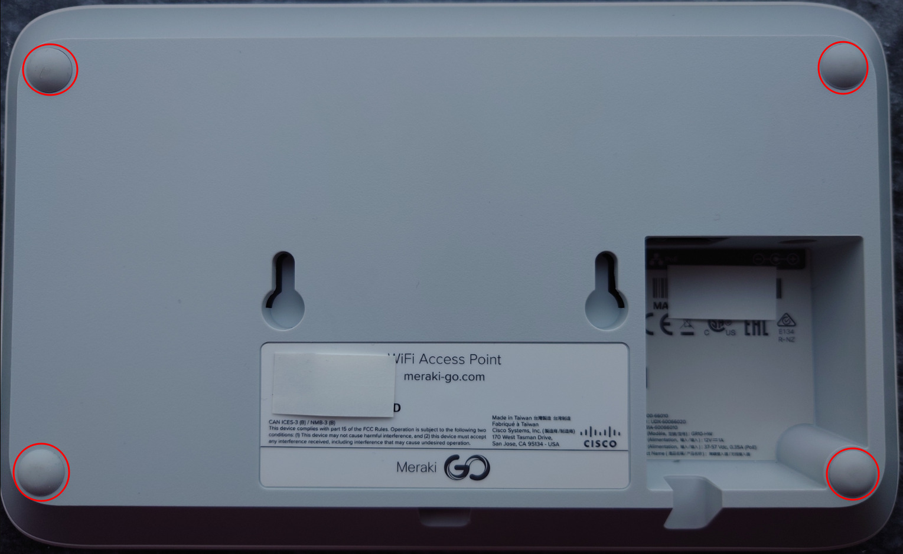
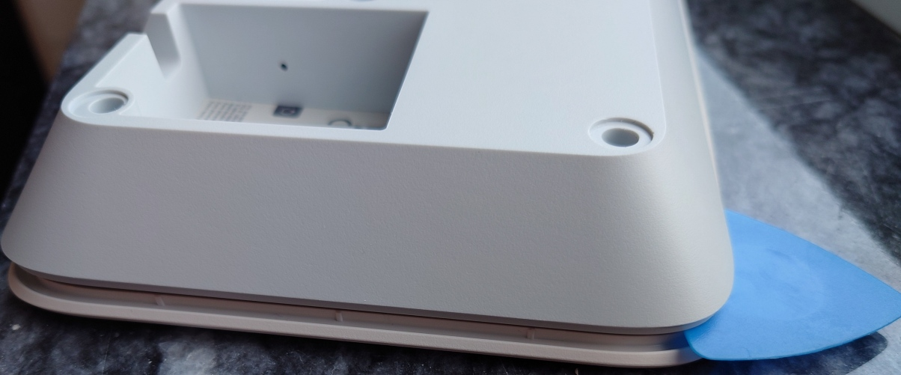
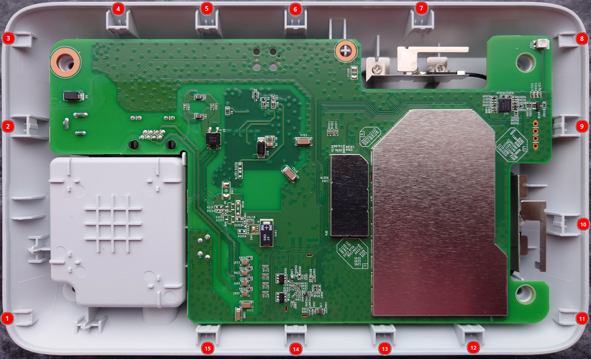
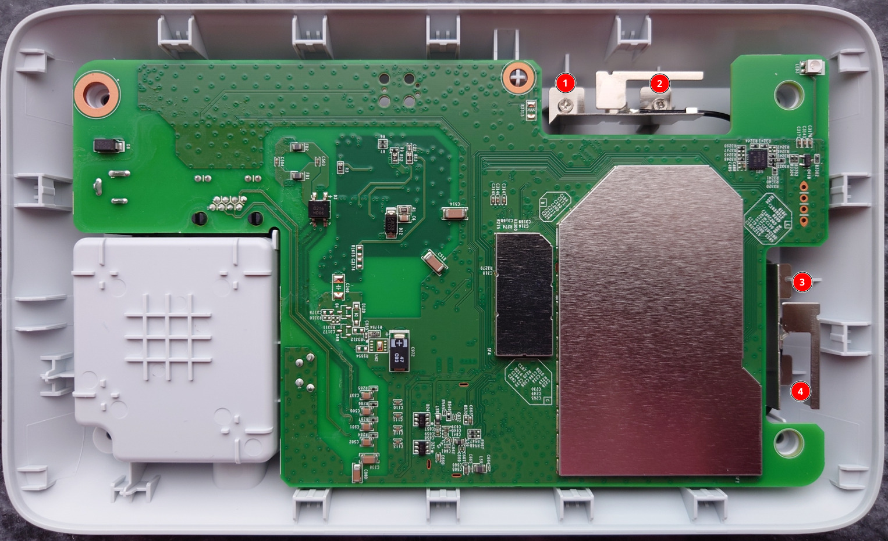
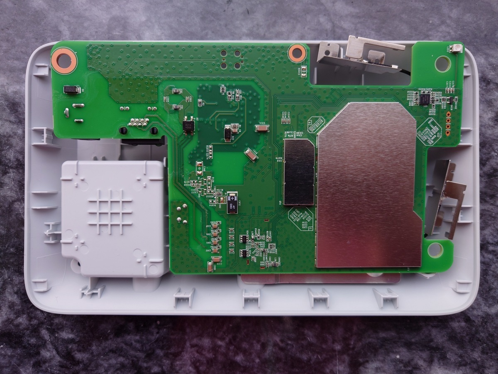
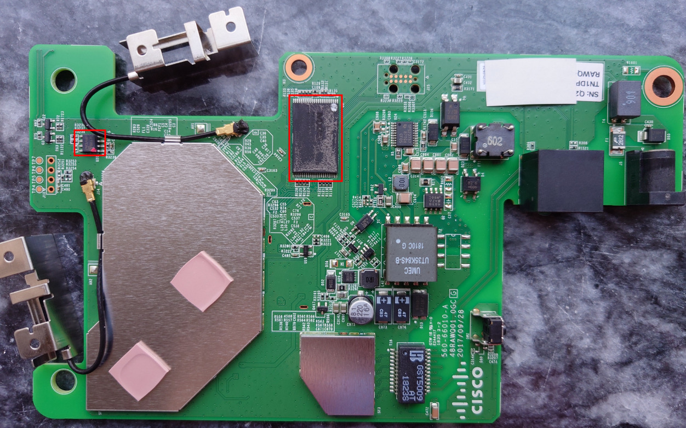

# Overview

The Meraki MR20 is a Cisco 802.11ac/WiFi 5 AP with 1 Ethernet port. It can be powered by a 12V DC barrel jack (5.5x2.5mm, center positive) or via 802.3af POE.

The Meraki Go GR10 (codename: Maggot) is identical to the MR20 (codename: Grub), so this document will refer to both devices as the MR20.

|||
|--|--|
|Model|MR20|
|CPU|Qualcomm Atheros IPQ4029|
|Flash MB|128 NAND|
|RAM MB|256|
|WLAN Hardware|Qualcomm Atheros IPQ4029|
|WLAN 2.4GHz|b/g/n 2x2|
|WLAN 5.0GHz|a/n/ac 2x2|
|Ethernet 1Gbit ports|1|

# Disclaimer

The following instructions are provided AS-IS and the author assumes no liability for any damages incurred.

Disassembling your devices and flashing bootloaders/firmwares will VOID any remaining warranty. Incorrectly flashing your device will lead to a brick that is only recoverable via hardware methods.

By continuing, you acknowledge that you understand the risks and hereby assume all responsibility for any damages or loss of functionality that may result.

# Disassembly

Remove the four rubber feet on the rear of the AP and the four Torx T8 screws under the feet.



Using a guitar pick or similar plastic tool, insert it on the side along the seam around the edge. Push in gently while gently lifting the front of the housing to release the plastic retention clips.



There are 15 clips in total.



Once you have removed the plastic front (shown above already removed so you know where the clips are), remove the 4 Philips screws holding down the two metal WiFi antennas.



Lift the PCB gently while pushing the Ethernet port into the housing to release it. The PCB should come free from the metal heat spreader.



The TSOP48 NAND flash (U9, Macronix/MXIC MX30LF1G18AC) is located on the opposite side of the PCB.



To flash, you need to desolder the TSOP48 or use a 360 clip.

You also need to reprogram the I2C EEPROM (U20, Atmel 24c64).

# Installation

This device ships with secure boot enabled from the factory. Meraki have disabled interrupting U-Boot.

You will need a hardware flashing tool for TSOP48 NAND (3.3V) such as the NANDWay, XGecu TL866/T48/T56.

**Note**: Hardware NAND flashing tools typically cost more than the device is worth.

You will need a hardware flashing tool for the Atmel 24c64 I2C EEPROM, such as the ch341a.

## UART

UART on these devices is 115200 baud, 3.3V.

The UART header is J10, 2.54mm pitch and is unpopulated. You can solder a 2.54mm header or use pogopins or similar on the test-pads directly above the UART header.

DO NOT CONNECT TO THE VCC PIN. You will cause permanent damage to the device!

The UART pinout is:
|Pin|Test Pad|Function|
|--|--|--|
|1|TP4|Vcc (DO NOT CONNECT)|
|2|TP5|Tx|
|3|TP6|Rx|
|4|TP7|Ground|

## Hardware flashing

Here is the flash layout of the MR20:
```
0x000000000000-0x000000100000 : "sbl1"
0x000000100000-0x000000200000 : "mibib"
0x000000200000-0x000000300000 : "bootconfig"
0x000000300000-0x000000400000 : "qsee"
0x000000400000-0x000000500000 : "qsee_alt"
0x000000500000-0x000000580000 : "cdt"
0x000000580000-0x000000600000 : "cdt_alt"
0x000000600000-0x000000680000 : "ddrparams"
0x000000700000-0x000000900000 : "u-boot"
0x000000900000-0x000000b00000 : "u-boot-backup"
0x000000b00000-0x000000b80000 : "ART"
0x000000c00000-0x000007c00000 : "ubi"
```

The above partition offsets exclude OOB data.

**Note**: The hardware dumping tool will dump NAND with OOB data, so the offsets will be slightly larger than the above.

Decompress `ubi.bin.gz` dump (contains OOB data) and overwrite the `ubi` portion of NAND from `0xc60000-0x8400000` (length `0x77a0000`).

You will need access to UART to `tftpboot` the OpenWrt initramfs image after flashing NAND. The NAND dump only contains an unlocked U-Boot.

If your device has a U-Boot release later than `U-Boot 2017.07-RELEASE-g78ed34f31579 (Sep 29 2017 - 07:43:44 -0700)`, you should overwrite the `u-boot` region as well.

Decompress `u-boot.bin.gz` dump (contains OOB data) and overwrite the `u-boot` portion of NAND from `0x738000-0x948000` (length `0x210000`).

## EEPROM

The board major number must be changed in the EEPROM to disable secure boot. [More details available here](https://watchmysys.com/blog/2024/04/breaking-secure-boot-on-the-meraki-z3-and-meraki-go-gx20/).

Change the byte at offset `0x49` to `0x1e`. It will be originally `0x25` (Go GR10) or `0x2c` (MR20).

Assuming you have dumped the EEPROM to the file `eeprom.bin` this can be done on Linux via the following command:
```
printf "\x1e" | dd of=eeprom.bin bs=1 count=1 seek=$((0x49)) conv=notrunc
```

Flash the I2C EEPROM with the modified contents. Note that the device will not boot if you modify the board major number and have not overwritten the `ubi` region of NAND.

## Boot OpenWrt initramfs

Once the AP has booted into U-Boot, press space (" ") to interrupt boot:
```
U-Boot 2017.07-RELEASE-g78ed34f31579 (Sep 29 2017 - 07:43:44 -0700)

DRAM:  242 MiB
machid : 0x8010001
Product: meraki_Stinkbug
NAND:  ONFI device found
128 MiB
Using default environment

In:    serial
Out:   serial
Err:   serial
machid: 8010001
ubi0: attaching mtd1
ubi0: scanning is finished
ubi0: attached mtd1 (name "mtd=0", size 115 MiB)
ubi0: PEB size: 131072 bytes (128 KiB), LEB size: 126976 bytes
ubi0: min./max. I/O unit sizes: 2048/2048, sub-page size 2048
ubi0: VID header offset: 2048 (aligned 2048), data offset: 4096
ubi0: good PEBs: 920, bad PEBs: 0, corrupted PEBs: 0
ubi0: user volume: 2, internal volumes: 1, max. volumes count: 128
ubi0: max/mean erase counter: 225/96, WL threshold: 4096, image sequence number: 2086049366
ubi0: available PEBs: 889, total reserved PEBs: 31, PEBs reserved for bad PEB handling: 20
Read 0 bytes from volume part.safe to 84000000
No size specified -> Using max size (253952)
## Loading kernel from FIT Image at 84000000 ...
   Using 'config@1' configuration
   Trying 'kernel-1' kernel subimage
     Description:  Kernel
     Type:         Kernel Image
     Compression:  gzip compressed
     Data Start:   0x840000c8
     Data Size:    194222 Bytes = 189.7 KiB
     Architecture: ARM
     OS:           Linux
     Load Address: 0x87300000
     Entry Point:  0x87300000
     Hash algo:    sha1
     Hash value:   617707b06292455b8c6d58ba9314c6ebc81787dd
   Verifying Hash Integrity ... sha1+ OK
   Uncompressing Kernel Image ... OK
Using machid 0x8010001 from environment

Starting kernel ...


U-Boot 2017.07-DEVEL (Oct 27 2025 - 20:07:48 +0000)

DRAM:  242 MiB
machid : 0x8010001
Product: meraki_Maggot
NAND:  ONFI device found
128 MiB
Using default environment

In:    serial
Out:   serial
Err:   serial
machid: 8010001
Net:   MAC0 addr:00:11:22:33:44:55
PHY ID1: 0x4d
PHY ID2: 0xd072
ipq40xx_ess_sw_init done
eth0
Autoboot in 2 seconds
GRUB #
```

**Note**: MR20 prompt is `GRUB #`, Go GR10 prompt is `MAGGOT #`. The OpenWrt MR20 image is compatible with both devices.

You can run a DHCP and `tftp` server on your computer easily using `dnsmasq`:
```
sudo dnsmasq -a 192.168.10.1 -F 192.168.10.10,192.168.10.20,2h -i eth0 -I lo,docker0,wlan0 -d --bind-interfaces --tftp-root=/tmp/
```

Place the `openwrt-ipq40xx-generic-meraki_mr20-initramfs-uImage.itb` file in the path you specified after `--tftp-root=` (the above example uses `/tmp/`, note if you are on a public network this is NOT SECURE)

Proceed to load and execute the OpenWrt initramfs image:
```
GRUB # setenv serverip <your tftp server IP>
GRUB # dhcp
GRUB # tftpboot openwrt-ipq40xx-generic-meraki_mr20-initramfs-uImage.itb
GRUB # bootm
```

### ART

OpenWrt expects an ubivol named `ART` with the WiFi calibration data specific to your device. For your convenience, the ART ubivol has already been created in the `ubi` dump, but it **does not contain any calibration data**.

From the OpenWrt `initramfs` image that you tftp booted, copy the `ART` calibration data from the NAND partition to the ART ubivol using the following commands:
```
cat /dev/mtd10 > /tmp/ART.bin
ubiupdatevol /dev/ubi0_1 /tmp/ART.bin
```

**WARNING**: Ensure that you ONLY update `ubi0_1` or you will have to reflash NAND using a hardware programmer! `ubi0_0` contains the unlocked U-Boot required to boot OpenWrt!

**Note:** If you skip this step, OpenWrt will boot but **WiFi will not work** until you copy the ART data from the mtd device to the ART ubivol and **reboot**.

## Install OpenWrt via sysupgrade

scp the OpenWrt `sysupgrade` image to the MR20 and install:
```
scp -O openwrt-ipq40xx-generic-meraki_mr20-squashfs-sysupgrade.bin root@192.168.1.1:/tmp/
ssh root@192.168.1.1 "sysupgrade -n /tmp/openwrt-ipq40xx-generic-meraki_mr20-squashfs-sysupgrade.bin"
```

The router will reboot and boot the OpenWrt installation from NAND.


# FAQ

Q: Why does the device `dhcp` on every boot from U-Boot?

A: The Ethernet PHY in the device requires some [extra setup](https://github.com/halmartin/wired-arm-qca-meraki-linux/blob/4220375b89153be1fa728b6cb62118d6c0fb166c/drivers/net/ethernet/qcom/essedma/edma_reset.c#L53-L60), otherwise Ethernet does not work in Linux. This setup was deemed too painful to upstream to the Linux kernel, especially as no other devices require it. Running `dhcp` in U-Boot is the easiest way to initialise the Ethernet PHY before booting OpenWrt.