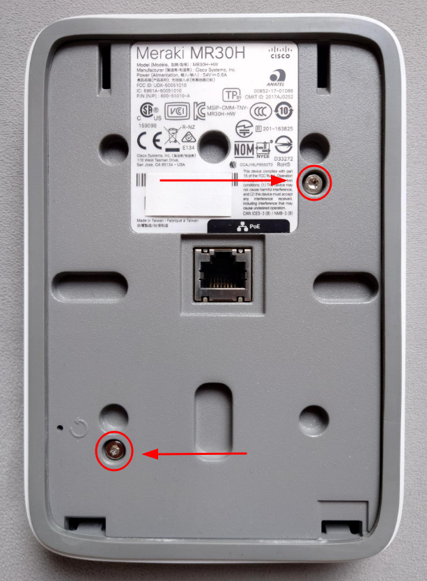
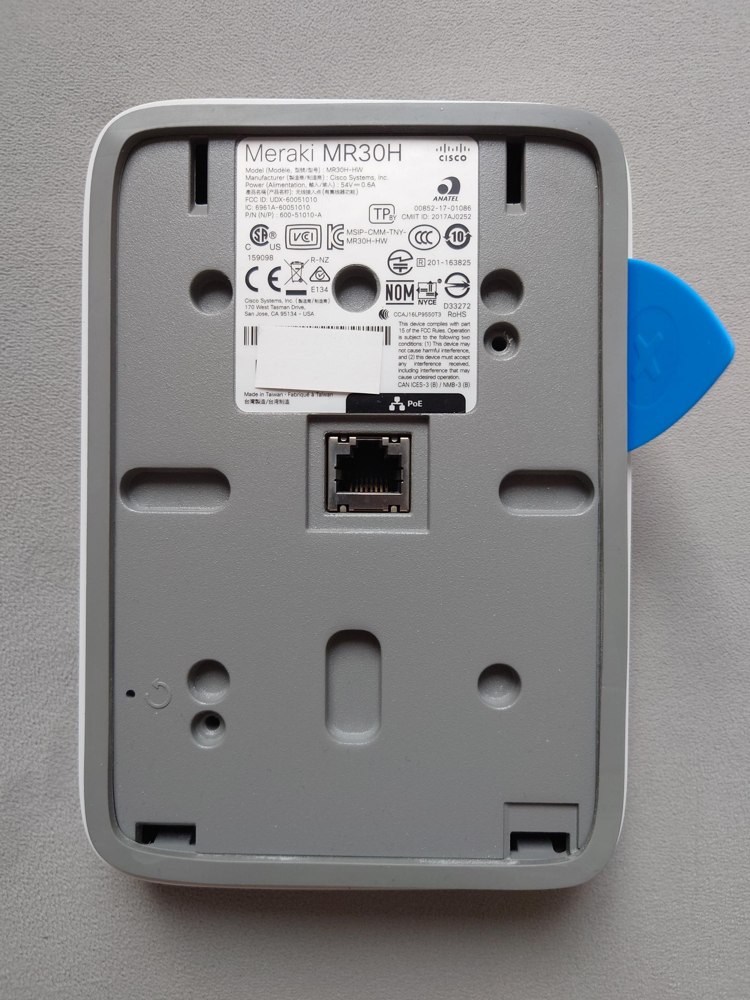
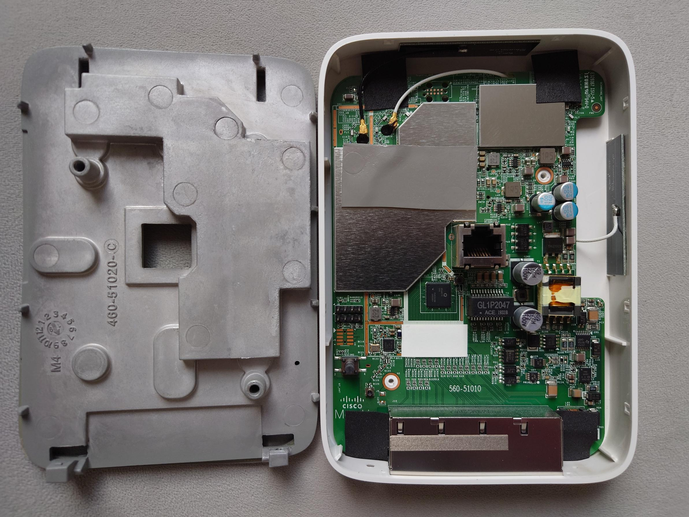
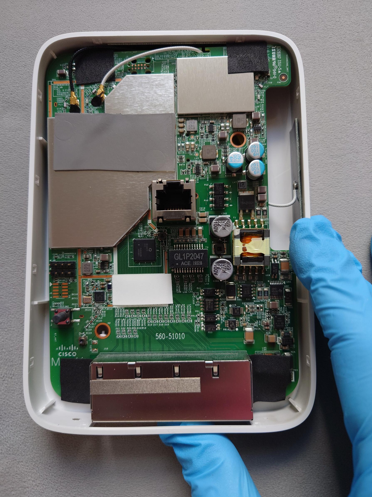
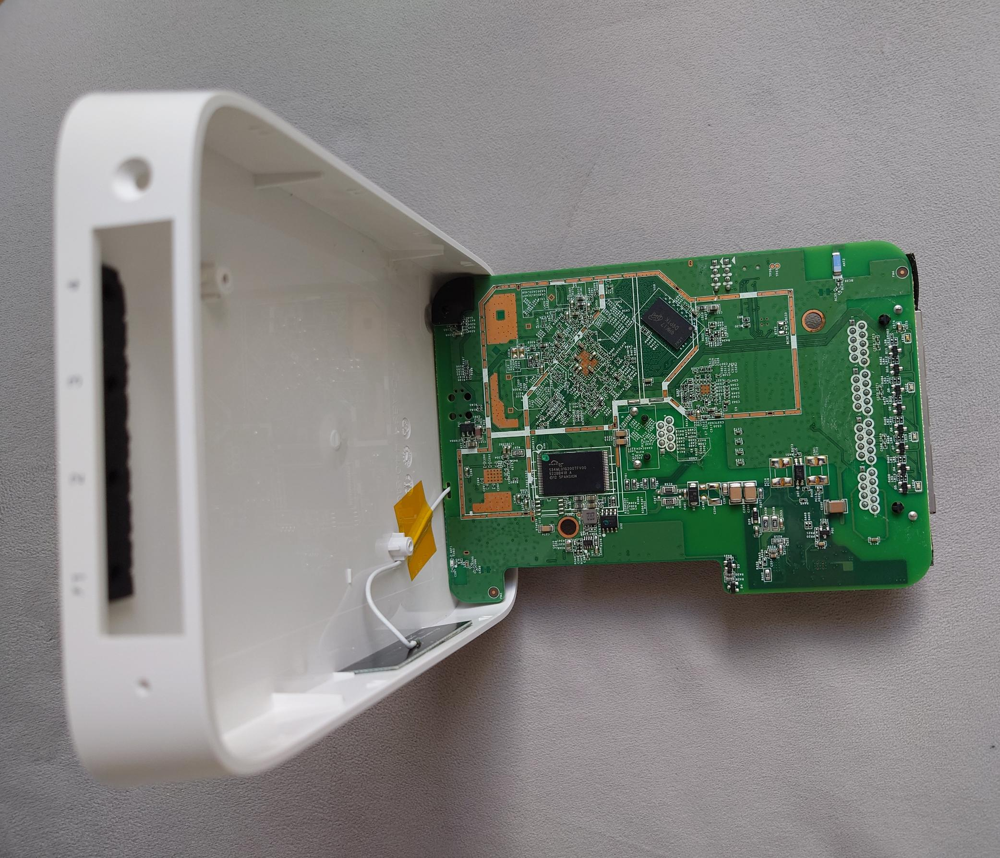
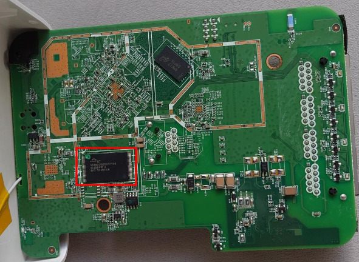
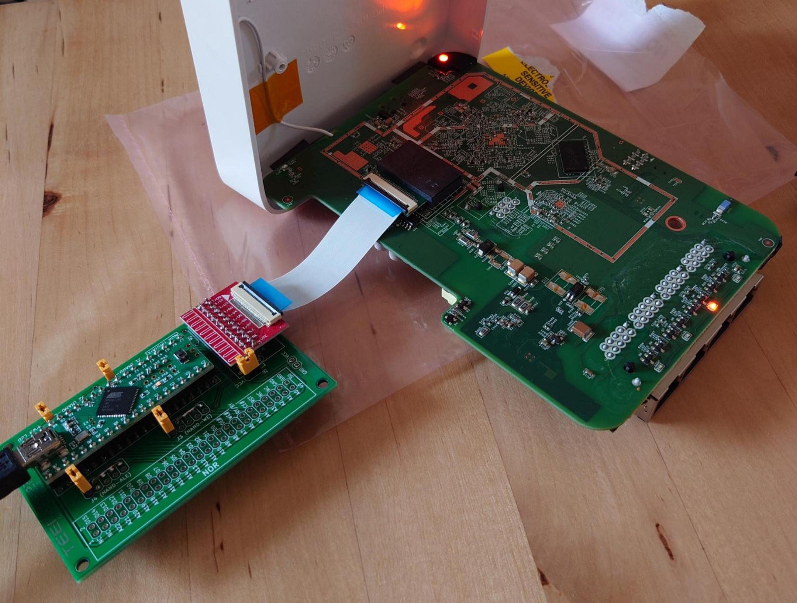

# Meraki MR30H

## Overview

The Meraki MR30H is a Cisco AP with 5 Gigabit Ethernet ports. It is powered solely by POE (802.3af/at) on the rear Ethernet port. If powered by 802.3at (30W), port 1 provides 802.3af (15W) output.

|||
|--|--|
|Model|MR30H|
|CPU|Qualcomm Atheros IPQ4029|
|Flash MB|128 NAND|
|RAM MB|256|
|WLAN Hardware|Qualcomm Atheros IPQ4029, Qualcomm Atheros QCA9889|
|WLAN 2.4GHz|b/g/n 2x2, b/g/n 1x1|
|WLAN 5.0GHz|a/n/ac 2x2, a/n/ac 1x1|
|Ethernet 1Gbit ports|5|

## Quick Start

This section provides a condensed guide for experienced users who want to quickly flash OpenWRT on their MR30H:

1. Disassemble the device (remove two T10 screws, pry open case)
2. Connect UART to J8 header (115200 baud, 3.3V)
3. For devices with U-Boot before September 2017:
   - Use `ubootwrite.py` to flash new U-Boot
   - Write U-Boot to `part.safe` for safety
4. For newer devices:
   - Use hardware NAND programmer to flash U-Boot
5. Boot into new U-Boot and interrupt with space key
6. Load and flash OpenWRT firmware via TFTP
7. Reboot and enjoy!

# Disclaimer

The following instructions are provided AS-IS and the author assumes no liability for any damages incurred.

Disassembling your devices and flashing bootloaders/firmwares will VOID any remaining warranty. Incorrectly flashing your device will lead to a brick that is only recoverable via hardware methods.

By continuing, you acknowledge that you understand the risks and hereby assume all responsibility for any damages or loss of fucntionality that may result.

# Disassembly

Remove the two T10 screws on the rear of the AP.


*Figure 1: Rear view of the MR30H showing the location of the two T10 screws (circled) that need to be removed for disassembly.*

Using a guitar pick or similar plastic tool, insert it on the side between the grey metal plate and the white plastic body and pry up gently.


*Figure 2: Demonstration of using a plastic tool to gently pry between the grey metal plate and white plastic body.*

The rubberised border on the metal plate *does not* need to be removed.

The metal back plate has several latches around the perimeter (but none on the bottom by the Ethernet ports).


*Figure 3: View of the MR30H with the metal back plate removed, showing the latches around the perimeter that secure the plate.*

Once you have removed the metal back plate, push up gently on the bottom Ethernet ports while pulling gently on the rear-mounted Ethernet port to remove the PCB.


*Figure 4: Demonstration of how to remove the PCB by pushing up on the bottom Ethernet ports while pulling on the rear-mounted port.*

The PCB should come free from the plastic housing, pull the bottom (4 Ethernet ports) up as if you are opening a book.


*Figure 5: The MR30H with PCB opened like a book, showing the internal components and antenna connections.*

If done carefully, there is no need to remove the WiFi antenna connectors to access the NAND flash.

The TSOP48 NAND flash (U30, Spansion S34ML01G200TFV00) is located on the opposite side of the PCB.


*Figure 6: Close-up of the TSOP48 NAND flash chip (U30, Spansion S34ML01G200TFV00) that needs to be flashed.*

To flash, you need to desolder the TSOP48 or use a 360 clip.


*Figure 7: Demonstration of using a 360 clip to connect to the NAND flash chip for in-circuit programming without desoldering.*

## Installation

The MR30H does not have secure boot enabled. Similar to the MR33, Meraki have disabled interrupting U-Boot.

### Installation Methods

| Method | Success Rate | Difficulty | Requirements |
|--------|--------------|------------|--------------|
| UART Software Flash (pre-Sep 2017) | ~90% | Easy | UART adapter, Python 3 |
| Hardware NAND Flash | ~99% | Hard | NAND programmer, soldering skills |
| 360 Clip NAND Flash | ~75% | Medium | 360 clip, steady hands |

If your MR30H has U-Boot with a compilation date after September 2017, you will need a hardware flashing tool for TSOP48 NAND (3.3V) such as the NANDWay, XGecu TL866/T48/T56.

**Note**: Hardware NAND flashing tools typically cost more than the device is worth.

Older U-Boot versions compiled *before* September 2017 can use the python script `ubootwrite.py` to upload a new U-Boot over UART.

## Hardware flashing

Here is the flash layout of the MR30H:
```
0x000000000000-0x000000100000 : "sbl1"
0x000000100000-0x000000200000 : "mibib"
0x000000200000-0x000000300000 : "bootconfig"
0x000000300000-0x000000400000 : "qsee"
0x000000400000-0x000000500000 : "qsee_alt"
0x000000500000-0x000000580000 : "cdt"
0x000000580000-0x000000600000 : "cdt_alt"
0x000000600000-0x000000680000 : "ddrparams"
0x000000700000-0x000000900000 : "u-boot"
0x000000900000-0x000000b00000 : "u-boot-backup"
0x000000b00000-0x000000b80000 : "ART"
0x000000c00000-0x000007c00000 : "ubi"
```

The above partition offsets exclude OOB data.

**Note**: The hardware dumping tool will dump NAND with OOB data, so the offsets will be slightly larger than the above.

Decompress `u-boot.bin.gz` dump (which contains OOB data) and overwrite the U-Boot portion of NAND from `0x738000-0x948000` (length `0x210000`).

## Software flashing (ubootwrite)

Use the `ubootwrite.py` script from the tools directory to transfer the `u-boot.itb` image to the router. The UART header is J8, 3.3V, 115200 and follows the typical Meraki pinout: 1: Vcc (DO NOT CONNECT), 2: Tx, 3: Rx, 4: GND.

**Note**: The `.itb` file is a [Flattened Image Tree](https://docs.u-boot.org/en/latest/usage/fit/index.html). We prefer `u-boot.itb` to sending `u-boot.bin` because it is compressed and thus smaller/faster to transfer.

```
../tools/ubootwrite.py --serial=/dev/ttyUSB0 --write u-boot.itb
```

To avoid bricking your router, it is *highly* recommended at this point that you flash the unlocked U-Boot to the `part.safe` ubi volume. This can be done from U-Boot with the following commands:

```
run set_ubi && ubi write $loadaddr part.safe 0x2fd48
```

The stock Meraki U-Boot will boot `part.safe` which is now the unlocked U-Boot.

### Replacing stock U-Boot

Writing U-Boot to `part.safe` is convenient but will cause a boot-loop because both U-Boot builds expect the firmware to be present on `part.safe`

Use the new U-Boot build to tftpboot the `factory` OpenWrt image:
```
setenv serverip <tftp_server_addr>
dhcp
tftpboot openwrt-ipq40xx-generic-meraki_mr30h-initramfs-uImage.itb
bootm
```

It is only recommended to flash U-Boot to the `u-boot` NAND region from Linux:
```
insmod mtd-rw i_want_a_brick=1
```

Copy `u-boot.elf` to the router:
```
scp -O u-boot.elf root@192.168.1.1:/tmp/
```

**Note**: If any of the below commands fails, YOU WILL HAVE A BRICK IF YOU REBOOT OR LOSE POWER.

```
flash_erase /dev/mtd8 0 0
nandwrite -p /dev/mtd8 /tmp/u-boot.elf
```

**Note**: ONLY use `u-boot.elf` when flashing the `u-boot` region (`mtd8`); `u-boot.bin` or `u-boot.itb` will BRICK YOUR DEVICE

You can now remove `part.safe`:
```
ubirmvol -N part.safe /dev/ubi0
```

# New U-Boot

The new U-Boot build uses the space character `" "` (without quotes) to interrupt boot.

It also supports networking (e.g. `tftpboot`) via LAN 4 on the MR30H.
