# Overview

The Meraki MR70 is a Cisco 802.11ac/WiFi 5 outdoor AP with 1 Ethernet port.
It can be powered by a 12V DC barrel jack (5.5x2.5mm, center positive)
or via 802.3af POE.

The Meraki Go GR60 (codename: Dungbeetle Omni) is identical to the MR70
(codename: Toe Biter Omni), so this document will refer to both devices as the MR70.

|||
|--|--|
|Model|MR70|
|CPU|Qualcomm Atheros IPQ4029|
|Flash MB|128 NAND|
|RAM MB|256|
|WLAN Hardware|Qualcomm Atheros IPQ4029|
|WLAN 2.4GHz|b/g/n 2x2|
|WLAN 5.0GHz|a/n/ac 2x2|
|Ethernet 1Gbit ports|1|

# Disclaimer

The following instructions are provided AS-IS and the author assumes no liability for any damages incurred.

Disassembling your devices and flashing bootloaders/firmwares will VOID any remaining warranty. Incorrectly flashing your device will lead to a brick that is only recoverable via hardware methods.

By continuing, you acknowledge that you understand the risks and hereby assume all responsibility for any damages or loss of functionality that may result.

# Disassembly

> **Note**: This is an outdoor device that is ultrasonically welded **and** glued to
weather seal it. Disassembly is required and WILL compromise the weather seal!

Start by removing the product label on the rear metal mounting plate.

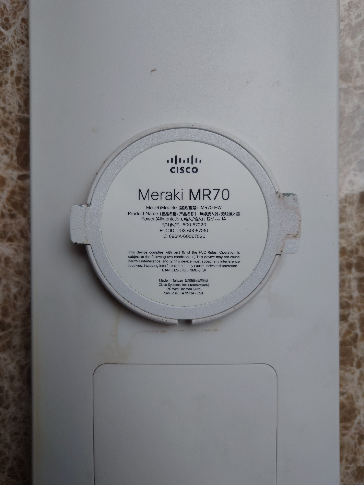

There are four Torx T8 screws under the sticker, remove the screws and
the mounting plate.

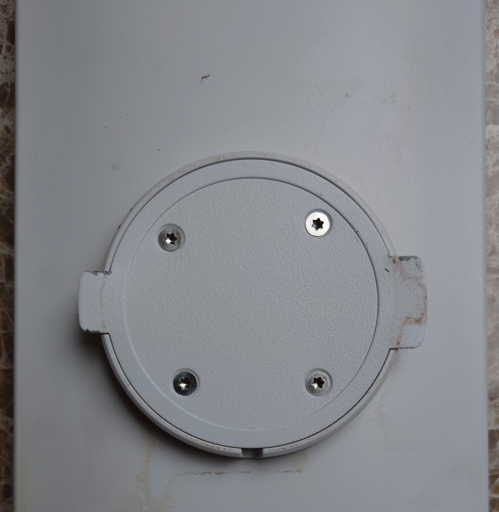

Remove the two Philips screws under the plate.

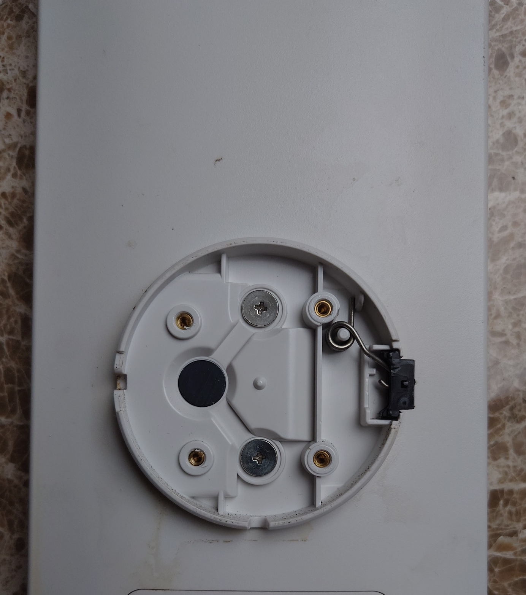

> **Note**: You ONLY need to cut through the outer ~2mm of ultrasonically welded plastic! The plastic is shown in purple, the glue in yellow.

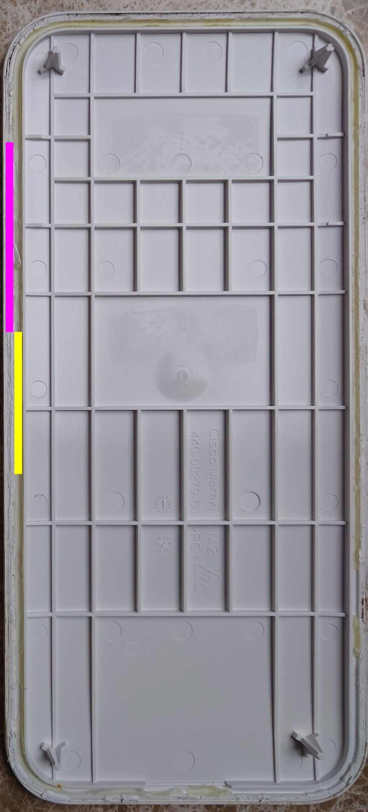

Using a chisel (or razor blade) and hammer, carefully cut around the circumfrence
of the device.

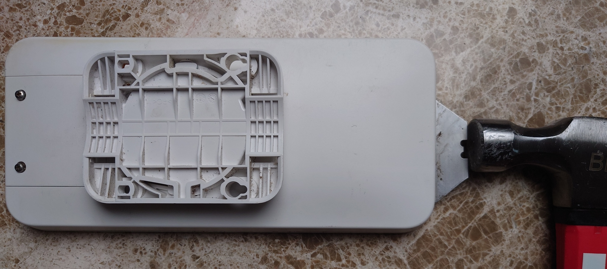

After cutting through the plastic, heat the edge of the device using a hair 
drier (or similar) to soften the glue. A heatgun is NOT recommended as
it will damage the plastic. It is only required to heat the device until
warm (~50C/~120F).

Using a plastic pry tool, insert it along the cut you made around
the edge and gently separate.  Insert a guitar pick into the opening
while gently lifting the front to cut the glue. The device is glued around
the entire circumfrence.

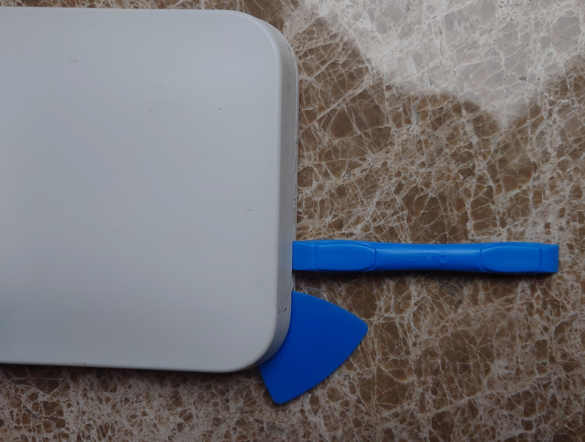

There may still be welded plastic which needs separating.
Be prepared to cut while prying.

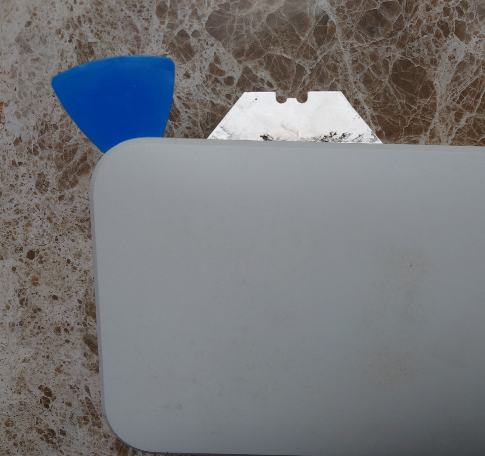

When you have cut the plastic and glue around the entire device,
remove the plastic front.


Remove the 4 Philips screws holding down the main PCB.

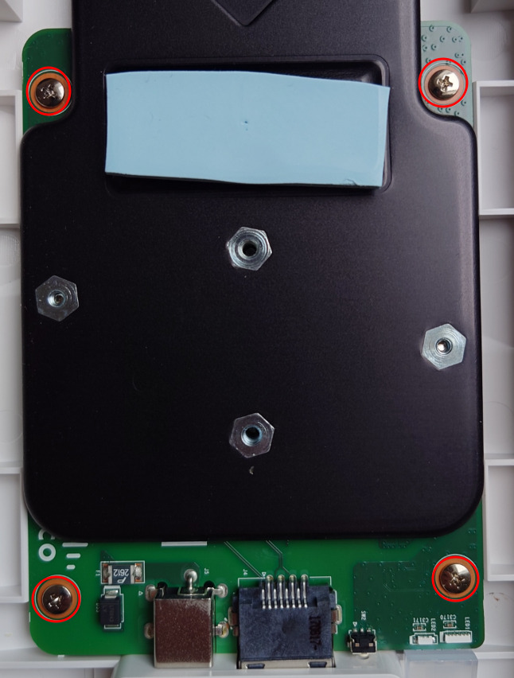

Release the two WiFi antennas by gently bending the antenna PCBs to the 
middle of the unit and pulling up.

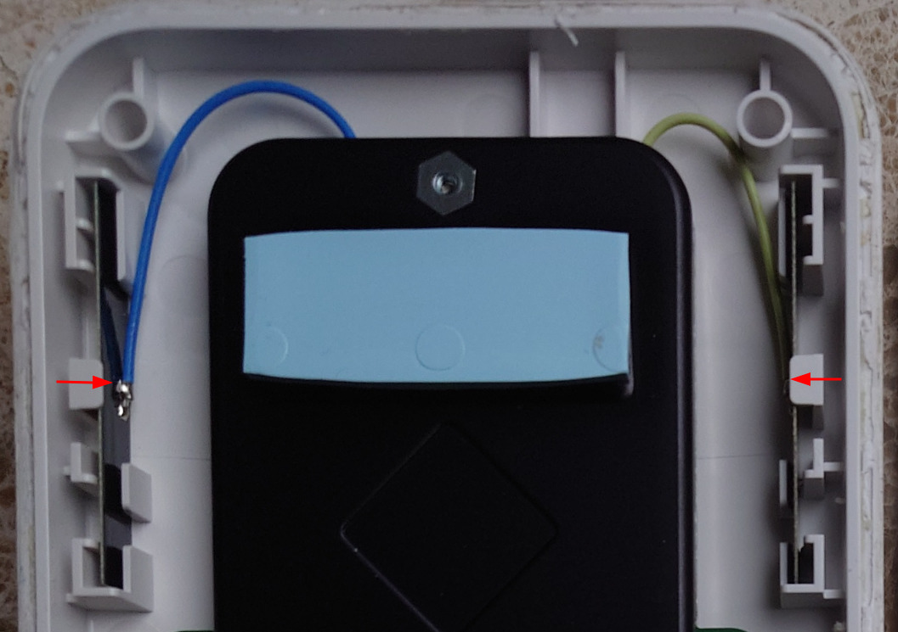

Lift the top of the PCB gently while pushing the Ethernet port into the
housing to release it. Turn the PCB over and remove the three Philips
screws holding the metal heat spreader.

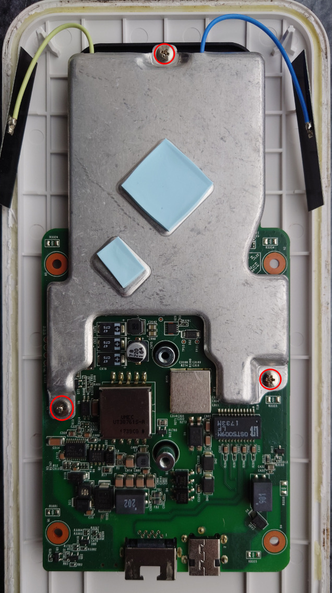

The TSOP48 NAND flash (U9, S34ML01G200 or W29N01HV) is located
under the metal heat spreader on the blue antenna side of the PCB.

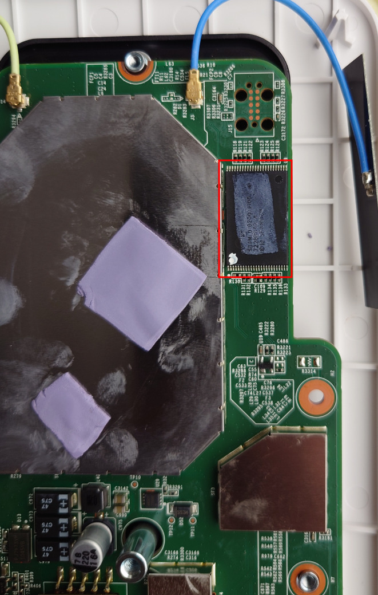

To flash, you need to desolder the TSOP48 or use a 360 clip.

You also need to reprogram the I2C EEPROM (U20, Atmel 24c64).

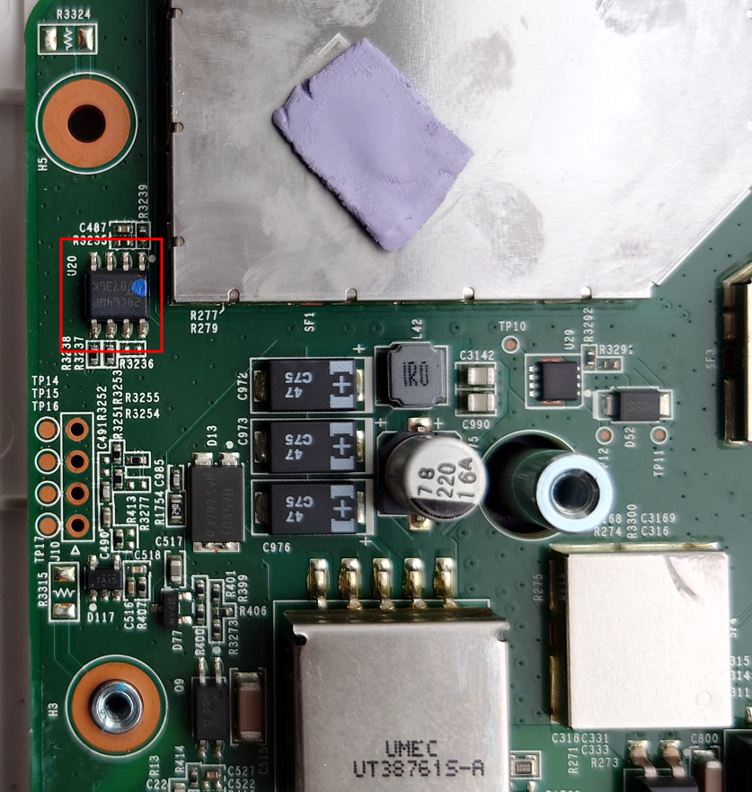

# Installation

This device ships with secure boot enabled from the factory. Meraki have disabled interrupting U-Boot.

You will need a hardware flashing tool for TSOP48 NAND (3.3V) such as the NANDWay, XGecu TL866/T48/T56.

**Note**: Hardware NAND flashing tools typically cost more than the device is worth.

You will need a hardware flashing tool for the Atmel 24c64 I2C EEPROM, such as the ch341a.

## UART

UART on these devices is 115200 baud, 3.3V.

The UART header is J10, 2.54mm pitch and is unpopulated. You can solder a 2.54mm header or use pogopins or similar on the test-pads directly beside the UART header.

DO NOT CONNECT TO THE VCC PIN. You will cause permanent damage to the device!

The UART pinout is:
|Pin|Test Pad|Function|
|--|--|--|
|1|TP17|Vcc (DO NOT CONNECT)|
|2|TP16|Tx|
|3|TP15|Rx|
|4|TP14|Ground|

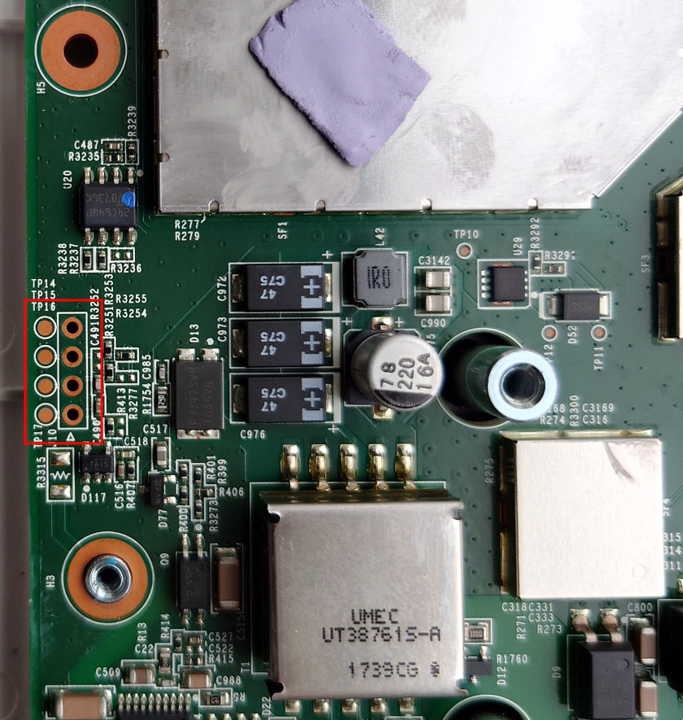

## Hardware flashing

Here is the flash layout of the mr70:
```
0x000000000000-0x000000100000 : "sbl1"
0x000000100000-0x000000200000 : "mibib"
0x000000200000-0x000000300000 : "bootconfig"
0x000000300000-0x000000400000 : "qsee"
0x000000400000-0x000000500000 : "qsee_alt"
0x000000500000-0x000000580000 : "cdt"
0x000000580000-0x000000600000 : "cdt_alt"
0x000000600000-0x000000680000 : "ddrparams"
0x000000700000-0x000000900000 : "u-boot"
0x000000900000-0x000000b00000 : "u-boot-backup"
0x000000b00000-0x000000b80000 : "ART"
0x000000c00000-0x000007c00000 : "ubi"
```

The above partition offsets exclude OOB data.

**Note**: The hardware dumping tool will dump NAND with OOB data, so the offsets will be slightly larger than the above.

Decompress `ubi.bin.gz` dump (contains OOB data) and overwrite the `ubi` portion of NAND from `0xc60000-0x7fe0000` (length `0x7380000`).

You will need access to UART to `tftpboot` the OpenWrt initramfs image after flashing NAND. The NAND dump only contains an unlocked U-Boot.

If your device has a U-Boot release later than `U-Boot 2017.07-RELEASE-g78ed34f31579 (Sep 29 2017 - 07:43:44 -0700)`, you should overwrite the `u-boot` region as well.

Decompress `u-boot.bin.gz` dump (contains OOB data) and overwrite the `u-boot` portion of NAND from `0x738000-0x948000` (length `0x210000`).

## EEPROM

The board major number must be changed in the EEPROM to disable secure boot. [More details available here](https://watchmysys.com/blog/2024/04/breaking-secure-boot-on-the-meraki-z3-and-meraki-go-gx20/).

Change the byte at offset `0x49` to `0x1e` (originally `0x2d` or `0x26`). Remember to
re-write the EEPROM with the modified data.

Assuming you have dumped the EEPROM to the file `eeprom.bin` this can be done on Linux via the following command:
```
printf "\x1e" | dd of=eeprom.bin bs=1 count=1 seek=$((0x49)) conv=notrunc
```

Flash the I2C EEPROM with the modified contents. Note that the device will not boot if you modify the board major number and have not overwritten the `ubi` region of NAND.

## Boot OpenWrt initramfs

Once the AP has booted into U-Boot, press space (" ") to interrupt boot when you see `Autoboot in # seconds`:
```
Format: Log Type - Time(microsec) - Message - Optional Info
Log Type: B - Since Boot(Power On Reset),  D - Delta,  S - Statistic
S - QC_IMAGE_VERSION_STRING=BOOT.BF.3.1.1-00096
S - IMAGE_VARIANT_STRING=DAACANAZA
S - OEM_IMAGE_VERSION_STRING=CRM
S - Boot Config, 0x00000025
S - Core 0 Frequency, 0 MHz
B -       262 - PBL, Start
B -      1341 - bootable_media_detect_entry, Start
B -      2618 - bootable_media_detect_success, Start
B -      2633 - elf_loader_entry, Start
B -      7202 - auth_hash_seg_entry, Start
B -   1387390 - auth_hash_seg_exit, Start
B -   1452162 - elf_segs_hash_verify_entry, Start
B -   1573925 - PBL, End
B -   1573949 - SBL1, Start
B -   1662691 - pm_device_init, Start
D -         6 - pm_device_init, Delta
B -   1664213 - boot_flash_init, Start
D -     87675 - boot_flash_init, Delta
B -   1755932 - boot_config_data_table_init, Start
D -     14030 - boot_config_data_table_init, Delta - (419 Bytes)
B -   1772665 - clock_init, Start
D -      7578 - clock_init, Delta
B -   1783645 - CDT version:2,Platform ID:8,Major ID:1,Minor ID:0,Subtype:1
B -   1787133 - sbl1_ddr_set_params, Start
B -   1792118 - cpr_init, Start
D -         2 - cpr_init, Delta
B -   1796608 - Pre_DDR_clock_init, Start
D -         5 - Pre_DDR_clock_init, Delta
D -     13143 - sbl1_ddr_set_params, Delta
B -   1809887 - pm_driver_init, Start
D -         2 - pm_driver_init, Delta
B -   1880422 - sbl1_wait_for_ddr_training, Start
D -        27 - sbl1_wait_for_ddr_training, Delta
B -   1897182 - Image Load, Start
D -   1311371 - QSEE Image Loaded, Delta - (268504 Bytes)
B -   3209050 - Image Load, Start
D -      2115 - SEC Image Loaded, Delta - (2048 Bytes)
B -   3219208 - Image Load, Start
D -   1306923 - APPSBL Image Loaded, Delta - (292280 Bytes)
B -   4526554 - QSEE Execution, Start
D -        56 - QSEE Execution, Delta
B -   4532732 - SBL1, End
D -   2960864 - SBL1, Delta
S - Flash Throughput, 1973 KB/s  (563251 Bytes,  285473 us)
S - DDR Frequency, 672 MHz


U-Boot 2017.07-RELEASE-g78ed34f31579 (Sep 29 2017 - 07:43:44 -0700)

DRAM:  242 MiB
machid : 0x8010001
Product: meraki_Stinkbug
NAND:  ONFI device found
128 MiB
Using default environment

In:    serial
Out:   serial
Err:   serial
machid: 8010001
ubi0: attaching mtd1
ubi0: scanning is finished
ubi0: attached mtd1 (name "mtd=0", size 115 MiB)
ubi0: PEB size: 131072 bytes (128 KiB), LEB size: 126976 bytes
ubi0: min./max. I/O unit sizes: 2048/2048, sub-page size 2048
ubi0: VID header offset: 2048 (aligned 2048), data offset: 4096
ubi0: good PEBs: 920, bad PEBs: 0, corrupted PEBs: 0
ubi0: user volume: 2, internal volumes: 1, max. volumes count: 128
ubi0: max/mean erase counter: 265/87, WL threshold: 4096, image sequence number: 1898397809
ubi0: available PEBs: 889, total reserved PEBs: 31, PEBs reserved for bad PEB handling: 20
Read 0 bytes from volume part.safe to 84000000
No size specified -> Using max size (253952)
## Loading kernel from FIT Image at 84000000 ...
   Using 'config@1' configuration
   Trying 'kernel-1' kernel subimage
     Description:  Kernel
     Type:         Kernel Image
     Compression:  gzip compressed
     Data Start:   0x840000cc
     Data Size:    194230 Bytes = 189.7 KiB
     Architecture: ARM
     OS:           Linux
     Load Address: 0x87300000
     Entry Point:  0x87300000
     Hash algo:    sha1
     Hash value:   ffc5d2cbd8bd288990d737c6b5af445a8373e4ac
   Verifying Hash Integrity ... sha1+ OK
   Uncompressing Kernel Image ... OK
Using machid 0x8010001 from environment

Starting kernel ...


U-Boot 2017.07-DEVEL (Feb 16 2026 - 16:46:31 +0000)

DRAM:  242 MiB
machid : 0x8010001
Product: meraki_Toe_biter_Omni
NAND:  ONFI device found
128 MiB
Using default environment

In:    serial
Out:   serial
Err:   serial
machid: 8010001
Net:   MAC0 addr:e0:cb:bc:00:be:ef
PHY ID1: 0x4d
PHY ID2: 0xd072
ipq40xx_ess_sw_init done
eth0
Autoboot in 2 seconds
TOE_BITER OMNI #
```

**Note**: MR70 prompt is `TOE BITER OMNI #`, Go GR60 prompt is `DUNGBEETLE OMNI #`. The OpenWrt MR70 image is compatible with both devices.

You can run a DHCP and `tftp` server on your computer easily using `dnsmasq`:
```
sudo dnsmasq -a 192.168.10.1 -F 192.168.10.10,192.168.10.20,2h -i eth0 -I lo,docker0,wlan0 -d --bind-interfaces --tftp-root=/tmp/
```

> **Note**: Replace `eth0` with the name of your Ethernet interface.

Place the `openwrt-ipq40xx-generic-meraki_mr70-initramfs-uImage.itb` file in the path you specified after `--tftp-root=` (the above example uses `/tmp/`, note if you are on a public network this is NOT SECURE)

Proceed to load and execute the OpenWrt initramfs image:
```
TOE_BITER OMNI # setenv serverip <your tftp server IP>
TOE_BITER OMNI # dhcp
TOE_BITER OMNI # tftpboot openwrt-ipq40xx-generic-meraki_mr70-initramfs-uImage.itb
TOE_BITER OMNI # bootm
```

### ART

OpenWrt expects an ubivol named `ART` with the WiFi calibration data specific to your device. For your convenience, the ART ubivol has already been created in the `ubi` dump, but it **does not contain any calibration data**.

From the OpenWrt `initramfs` image that you tftp booted, copy the `ART` calibration data from the NAND partition to the ART ubivol using the following commands:
```
cat /dev/mtd10 > /tmp/ART.bin
ubiupdatevol /dev/ubi0_1 /tmp/ART.bin
```

**WARNING**: Ensure that you ONLY update `ubi0_1` or you will have to reflash NAND using a hardware programmer! `ubi0_0` contains the unlocked U-Boot required to boot OpenWrt!

**Note:** If you skip this step, OpenWrt will boot but **WiFi will not work** until you copy the ART data from the mtd device to the ART ubivol and **reboot**.

## Install OpenWrt via sysupgrade

scp the OpenWrt `sysupgrade` image to the mr70 and install:
```
scp -O openwrt-ipq40xx-generic-meraki_mr70-squashfs-sysupgrade.bin root@192.168.1.1:/tmp/
ssh root@192.168.1.1 "sysupgrade -n /tmp/openwrt-ipq40xx-generic-meraki_mr70-squashfs-sysupgrade.bin"
```

The router will reboot and boot the OpenWrt installation from NAND.


# FAQ

Q: Why does the device `dhcp` on every boot?

A: The Ethernet PHY in the device requires some [extra setup](https://github.com/halmartin/wired-arm-qca-meraki-linux/blob/4220375b89153be1fa728b6cb62118d6c0fb166c/drivers/net/ethernet/qcom/essedma/edma_reset.c#L53-L60), otherwise Ethernet does not work in Linux. This setup was deemed too painful to upstream to the Linux kernel, especially as no other devices require it. Running `dhcp` in U-Boot is the easiest way to initialise the Ethernet PHY before booting OpenWrt.

Q: Is there a way to recover from a bad configuration without disassembly?

A: Yes, hold the reset button when the green LED begins flashing to enter [failsafe mode](https://openwrt.org/docs/guide-user/troubleshooting/failsafe_and_factory_reset). The power LED will be off in failsafe mode.

Q: Is there a way to recover from a bad flash if OpenWrt does not boot at all? (without disassembly)

A: Only if the OpenWrt FIT image on `part.old` is corrupt or missing. After attempting to boot from NAND, U-Boot will `dhcp` and then attempt to tftpboot `image.itb` from a tftp server at `192.168.254.254`. The `image.itb` on the tftpserver `192.168.254.254` should be the contents of `openwrt-ipq40xx-generic-meraki_mr70-initramfs-uImage.itb`

You can run a DHCP and `tftp` server on your computer easily using `dnsmasq`:
```
cp openwrt-ipq40xx-generic-meraki_mr70-initramfs-uImage.itb /tmp/image.itb
sudo dnsmasq -a 192.168.254.254 -F 192.168.254.10,192.168.254.20,2h -i eth0 -I lo,docker0,wlan0 -d --bind-interfaces --tftp-root=/tmp/
```