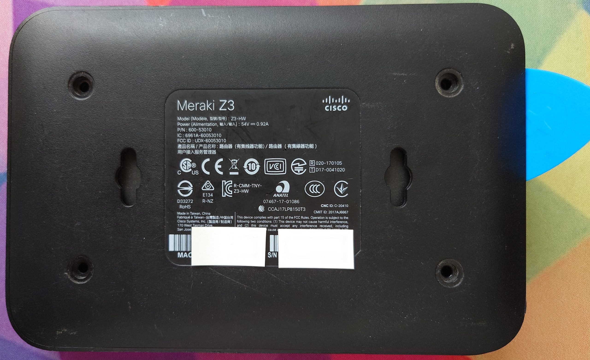
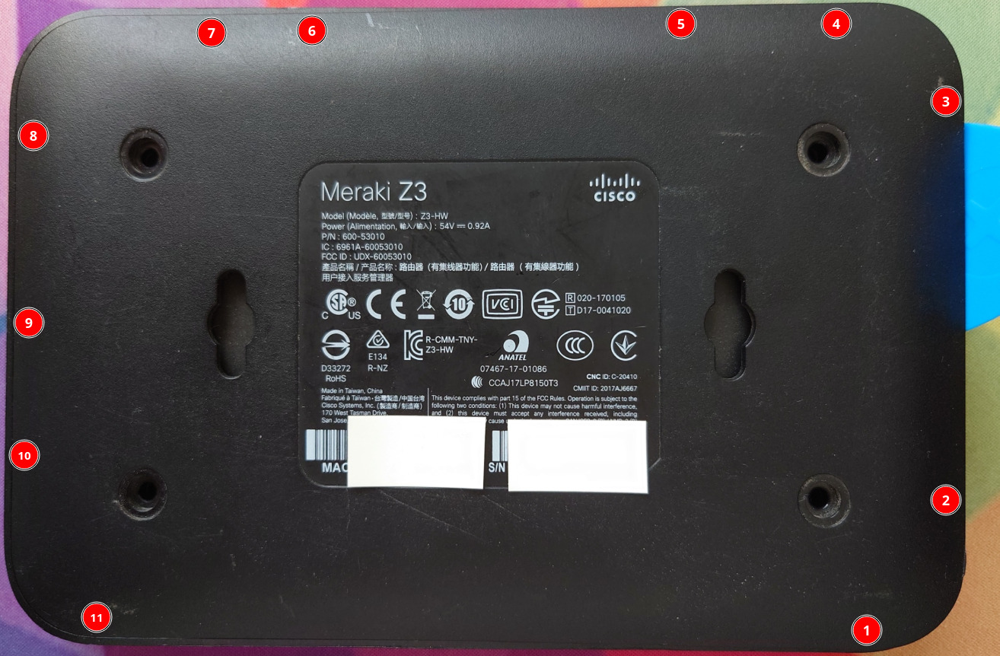
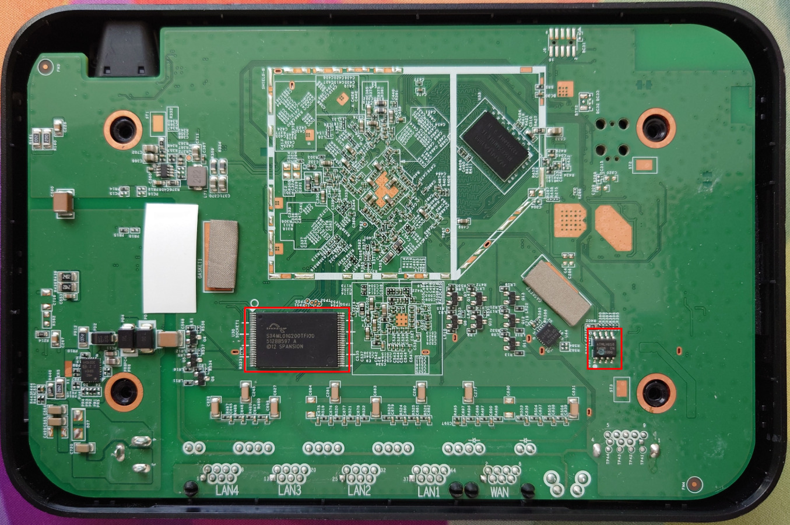

# Meraki Z3 and Go GX20

## Overview

### Z3

"Teleworker" device with 802.11ac and an integrated 5 port Gigabit switch.

Port 5 has POE output (802.3af). The WAN port is used for tftp booting in U-Boot.

This device ships with secure boot, and cannot be flashed without an external programmer.

|||
|--|--|
|Model|Z3|
|CPU|Qualcomm Atheros IPQ4029|
|Flash MB|128 NAND|
|RAM MB|512|
|WLAN Hardware|Qualcomm Atheros IPQ4029|
|WLAN 2.4GHz|b/g/n 2x2|
|WLAN 5.0GHz|a/n/ac 2x2|
|Ethernet 1Gbit ports|5|

### Go GX20

Wired router with 5 port Gigabit switch. It shares the same PCB as the Z3, but without the WiFi radios.

Port 5 has POE output (802.3af). The WAN port is used for tftp booting in U-Boot.

This device ships with secure boot, and cannot be flashed without an external programmer.

|||
|--|--|
|Model|Go GX20|
|CPU|Qualcomm Atheros IPQ4029|
|Flash MB|128 NAND|
|RAM MB|512|
|WLAN Hardware|N/A|
|WLAN 2.4GHz|N/A|
|WLAN 5.0GHz|N/A|
|Ethernet 1Gbit ports|5|

## Quick Start

This section provides a condensed guide for experienced users who want to quickly flash OpenWRT on their Z3/GX20:

1. Disassemble the device (remove four T8 screws under rubber feet, pry open case)
2. Connect UART to J8 header (115200 baud, 3.3V)
3. Use hardware NAND programmer to flash the NAND chip:
   - Desolder the TSOP48 NAND chip (in-circuit programming not reliable)
   - Flash the provided u-boot.bin and ubi.bin images
4. Modify the EEPROM to disable secure boot:
   - Change byte at offset 0x49 to 0x1e
5. Reassemble the device
6. Boot into new U-Boot and interrupt with space key
7. Load and flash OpenWRT firmware via TFTP through WAN port
8. Reboot and enjoy!

# Disclaimer

The following instructions are provided AS-IS and the author assumes no liability for any damages incurred.

Disassembling your devices and flashing bootloaders/firmwares will VOID any remaining warranty. Incorrectly flashing your device will lead to a brick that is only recoverable via hardware methods.

By continuing, you acknowledge that you understand the risks and hereby assume all responsibility for any damages or loss of fucntionality that may result.

# Disassembly

Remove the four T8 screws on the bottom of the device under the rubber feet.


*Figure 1: Bottom view of the Z3 showing the location of the four T8 screws (circled) hidden under the rubber feet.*

Using a guitar pick or similar plastic tool, insert it on the side between the bottom case and the side, pry up gently.


*Figure 2: Demonstration of using a guitar pick to gently pry between the bottom case and the side of the Z3.*

The plastic bottom has several latches around the perimeter (but none on the rear by the Ethernet ports).


*Figure 3: Close-up view of the retention clips around the perimeter of the Z3 case that secure the bottom plastic cover.*

The TSOP48 NAND flash (U30, Spansion S34ML01G200TFV00) is located on the bottom side of the PCB (facing you as you remove the bottom plastic). To flash, you will need to desolder the TSOP48. Attempts to flash in-circuit using a 360 clip were unsuccessful.


*Figure 4: The Z3 PCB showing the location of the TSOP48 NAND flash chip (U30) and the SOIC8 I2C EEPROM (U32) that need to be modified.*

The SOIC8 I2C EEPROM (U32, Atmel 24C64) is located on the bottom side of the PCB (facing you as you remove the bottom plastic). It can be flashed in circuit using a chip clip.

## Installation

The Z3/GX20 have secure boot enabled from the factory. Meraki have disabled interrupting U-Boot.

### Installation Methods

| Method | Success Rate | Difficulty | Requirements |
|--------|--------------|------------|--------------|
| Hardware NAND Flash | ~95% | Hard | NAND programmer, soldering skills |
| 360 Clip NAND Flash | ~30% | Medium | 360 clip, steady hands |
| EEPROM Modification | ~99% | Medium | SOIC8 clip or soldering skills |

You will need a hardware flashing tool for TSOP48 NAND (3.3V) such as the NANDWay, XGecu TL866/T48/T56.

**Note**: Hardware NAND flashing tools typically cost more than the device is worth.

## UART

UART on these devices is 115200 baud, 3.3V.

The UART header is J8, 2.54mm pitch and is populated.

DO NOT CONNECT TO THE VCC PIN. You will cause permanent damage to the device!

The UART pinout is:
|Pin|Function|
|--|--|
|1|Vcc (DO NOT CONNECT)|
|2|Tx|
|3|Rx|
|4|Ground|

## NAND

Here is the flash layout of the Z3/GX20:
```
0x000000000000-0x000000100000 : "sbl1"
0x000000100000-0x000000200000 : "mibib"
0x000000200000-0x000000300000 : "bootconfig"
0x000000300000-0x000000400000 : "qsee"
0x000000400000-0x000000500000 : "qsee_alt"
0x000000500000-0x000000580000 : "cdt"
0x000000580000-0x000000600000 : "cdt_alt"
0x000000600000-0x000000680000 : "ddrparams"
0x000000700000-0x000000900000 : "u-boot"
0x000000900000-0x000000b00000 : "u-boot-backup"
0x000000b00000-0x000000b80000 : "ART"
0x000000c00000-0x000007c00000 : "ubi"
```

The above partition offsets exclude OOB data.

Dump your original NAND (if using `nanddump`, include OOB data).

**Note**: A hardware dumping tool will dump NAND with OOB data, so the offsets will be slightly larger than the above.

Decompress `u-boot.bin.gz` dump (contains OOB data) and overwrite the `u-boot` portion of NAND from `0x738000-0x948000` (length `0x210000`).

Decompress `ubi.bin.gz` dump (contains OOB data) and overwrite the `ubi` portion of NAND from `0xc60000-0x8400000` (length `0x77a0000`).

## EEPROM

The board major number must be changed in the EEPROM to disable secure boot. [More details available here](https://watchmysys.com/blog/2024/04/breaking-secure-boot-on-the-meraki-z3-and-meraki-go-gx20/).

Change the byte at offset `0x49` to `0x1e`. It will be originally `0x24` (Z3) or `0x2b` (GX20).

Assuming you have dumped the EEPROM to the file `eeprom.bin` this can be done on Linux via the following command:
```
printf "\x1e" | dd of=/tmp/eeprom.bin bs=1 seek=$((0x49)) conv=notrunc
```

Flash the I2C EEPROM with the modified contents. Note that the device will not boot if you modify the board major number and have not overwritten the `ubi` and `u-boot` (if applicable) regions of NAND.

# New U-Boot

The new U-Boot build uses the space character `" "` (without quotes) to interrupt boot.

It also supports networking (e.g. `tftpboot`) via the WAN port.
