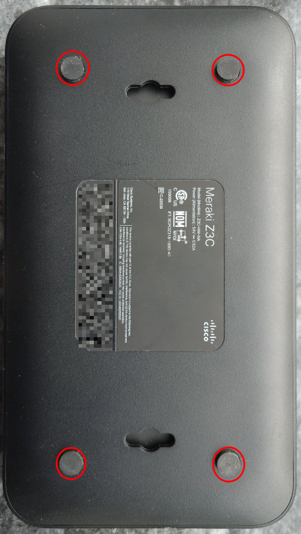
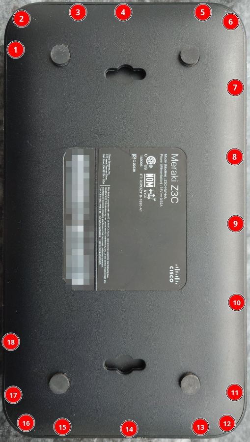
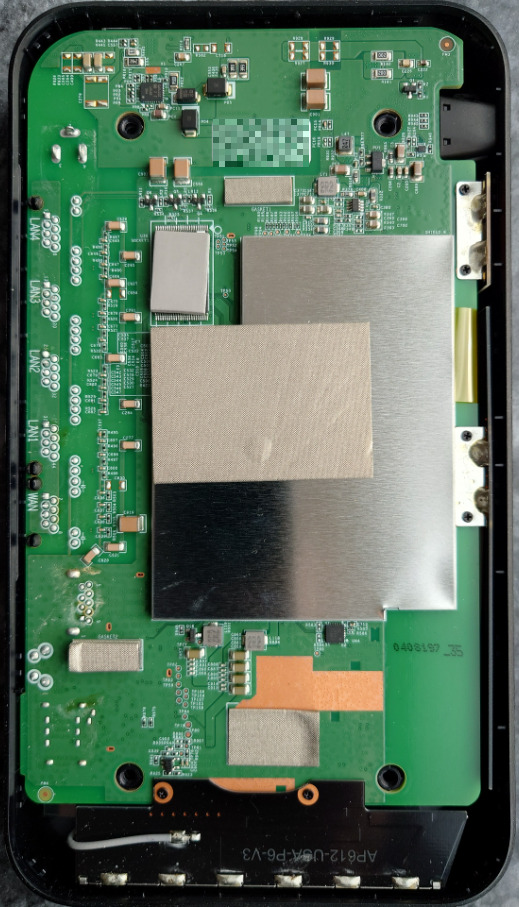
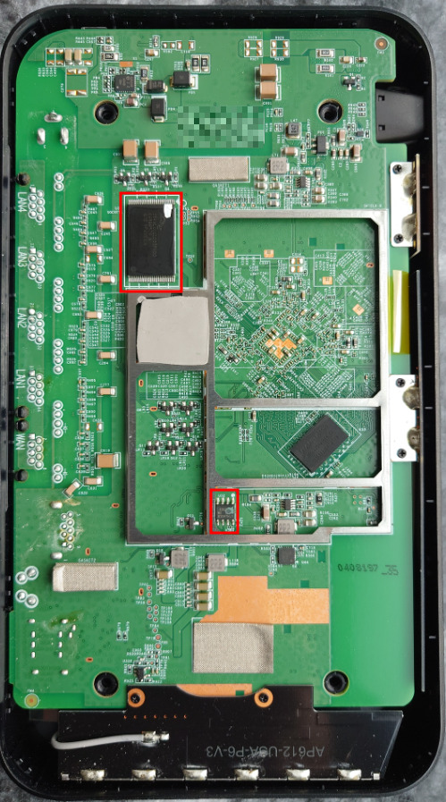
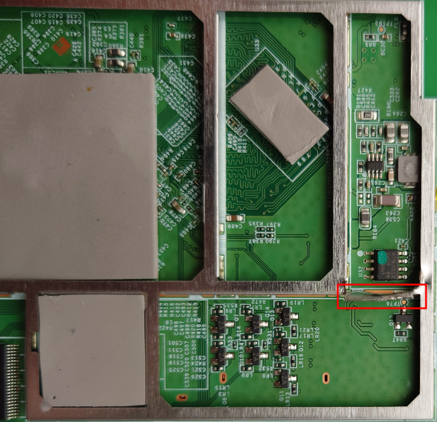
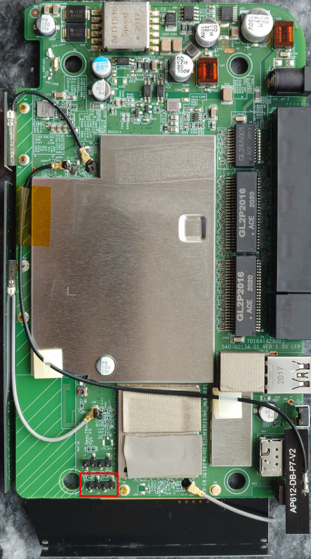

# Overview

## Z3C

"Teleworker" device with 802.11ac, LTE Cat 3 modem, and an integrated 5 port Gigabit switch.

Port 5 has POE output (802.3af). The WAN port is used for tftp booting in U-Boot.

This device ships with secure boot, and cannot be flashed without an external programmer.

|||
|--|--|
|Model|Z3C|
|CPU|Qualcomm Atheros IPQ4029|
|Flash MB|128 NAND|
|RAM MB|512|
|WLAN Hardware|Qualcomm Atheros IPQ4029|
|WLAN 2.4GHz|b/g/n 2x2|
|WLAN 5.0GHz|a/n/ac 2x2|
|WWAN|LTE Cat 3|
|Ethernet 1Gbit ports|5|

Z3C-HW-NA (NA: North American) supports LTE bands: 2,4,5,13,17

Z3C-HW-WW (WW: World-wide) supports LTE bands: 1,3,7,8,20

# Disclaimer

The following instructions are provided AS-IS and the author assumes no liability for any damages incurred.

Disassembling your devices and flashing bootloaders/firmwares will VOID any remaining warranty. Incorrectly flashing your device will lead to a brick that is only recoverable via hardware methods.

By continuing, you acknowledge that you understand the risks and hereby assume all responsibility for any damages or loss of functionality that may result.

# Disassembly

Remove the four T8 screws on the bottom of the device under the rubber feet.



Using a guitar pick or similar plastic tool, insert it on the side between the bottom case and the side, pry up gently. The plastic bottom has 18 latches around the perimeter (but none on the rear by the Ethernet ports). Remember to remove the SIM tray!



Gently remove the metal RF shield on the bottom of the PCB.



The TSOP48 NAND flash (U30, Spansion S34ML01G200TFV00) is located on the bottom side of the PCB (facing you as you remove the bottom plastic). To flash, you will need to desolder the TSOP48. Attempts to flash in-circuit using a 360 clip were unsuccessful.



The SOIC8 I2C EEPROM (U32, Atmel 24C64) is located on the bottom side of the PCB under a metal RF shield. It can be flashed in circuit using a chip clip. You may have to bend the RF shield up to fit the chip clip.



The UART header is on the top (opposite) side of the PCB. You do not need to remove any more screws to remove the PCB. The PCB has some thermal interface material for heat dissipation and will be slightly difficult to remove the first time. Gently pry up on the green PCB from one of the front corners until the thermal pads break contact with the top case. You can then lift out the entire PCB, including the attached LTE/WiFi antennas.

# Installation

The Z3C has secure boot enabled from the factory. Meraki have disabled interrupting U-Boot.

You will need a hardware flashing tool for TSOP48 NAND (3.3V) such as the NANDWay, XGecu TL866/T48/T56.

**Note**: Hardware NAND flashing tools typically cost more than the device is worth.

## UART

UART on these devices is 115200 baud, 3.3V.

The UART header is J8, 2.54mm pitch and is populated.



DO NOT CONNECT TO THE VCC PIN. You will cause permanent damage to the device!

The UART pinout is:
|Pin|Function|
|--|--|
|1|Vcc (DO NOT CONNECT)|
|2|Tx|
|3|Rx|
|4|Ground|

## NAND

Here is the flash layout of the Z3C:
```
0x000000000000-0x000000100000 : "sbl1"
0x000000100000-0x000000200000 : "mibib"
0x000000200000-0x000000300000 : "bootconfig"
0x000000300000-0x000000400000 : "qsee"
0x000000400000-0x000000500000 : "qsee_alt"
0x000000500000-0x000000580000 : "cdt"
0x000000580000-0x000000600000 : "cdt_alt"
0x000000600000-0x000000680000 : "ddrparams"
0x000000700000-0x000000900000 : "u-boot"
0x000000900000-0x000000b00000 : "u-boot-backup"
0x000000b00000-0x000000b80000 : "ART"
0x000000c00000-0x000007c00000 : "ubi"
```

The above partition offsets exclude OOB data.

Dump your original NAND (if using `nanddump`, include OOB data).

**Note**: A hardware dumping tool will dump NAND with OOB data, so the offsets will be slightly larger than the above.

Decompress `u-boot.bin.gz` dump (contains OOB data) and overwrite the `u-boot` portion of NAND from `0x738000-0x948000` (length `0x210000`).

Decompress `ubi.bin.gz` dump (contains OOB data) and overwrite the `ubi` portion of NAND from `0xc60000-0x8400000` (length `0x77a0000`).

## EEPROM

The board major number must be changed in the EEPROM to disable secure boot. [More details available here](https://watchmysys.com/blog/2024/04/breaking-secure-boot-on-the-meraki-z3-and-meraki-go-gx20/).

A USB programmer like the ch341a and a SOIC8 chip clip are an inexpensive option to reprogram the EEPROM. [ch341eeprom](https://github.com/command-tab/ch341eeprom.git) is a small utility to dump and re-write the EEPROM.

Change the byte at offset `0x49` to `0x1e`. It will be originally `0x2a`.

Assuming you have dumped the EEPROM to the file `eeprom.bin` this can be done on Linux via the following command:
```
printf "\x1e" | dd of=/tmp/eeprom.bin bs=1 seek=$((0x49)) conv=notrunc
```

Flash the I2C EEPROM with the modified contents. Note that the device will not boot if you modify the board major number and have not overwritten the `ubi` and `u-boot` (if applicable) regions of NAND.

## ART

OpenWrt expects an ubivol named `ART` with the WiFi calibration data specific to your device. For your convenience, the ART ubivol has already been created in the `ubi` dump, but it **does not contain any calibration data**.

From the OpenWrt `initramfs` image that you tftp booted, copy the `ART` calibration data from the NAND partition to the ART ubivol using the following commands:
```
cat /dev/mtd10 > /tmp/ART.bin
ubiupdatevol /dev/ubi0_1 /tmp/ART.bin
```

**WARNING**: Ensure that you ONLY update `ubi0_1` or you will have to reflash NAND using a hardware programmer! `ubi0_0` contains the unlocked U-Boot required to boot OpenWrt!

**Note:** If you skip this step, OpenWrt will boot but **WiFi will not work** until you copy the ART data from the mtd device to the ART ubivol and **reboot**.

# New U-Boot

The new U-Boot build uses the space character `" "` (without quotes) to interrupt boot.

It also supports networking (e.g. `tftpboot`) via the WAN port.

You can run a DHCP and `tftp` server on your computer easily using `dnsmasq`:
```
sudo dnsmasq -a 192.168.10.1 -F 192.168.10.10,192.168.10.20,2h -i eth0 -I lo,docker0,wlan0 -d --bind-interfaces --tftp-root=/tmp/
```

Place the `openwrt-ipq40xx-generic-meraki_z3c-initramfs-uImage.itb` file in the path you specified after `--tftp-root=` (the above example uses `/tmp/`, note if you are on a public network this is NOT SECURE)

Proceed to load and execute the OpenWrt initramfs image:
```
HOG # setenv serverip <your tftp server IP>
HOG # dhcp
HOG # tftpboot openwrt-ipq40xx-generic-meraki_z3c-initramfs-uImage.itb
HOG # bootm
```

# Install OpenWrt via sysupgrade

scp the OpenWrt `sysupgrade` image to the Z3C and install:
```
scp -O openwrt-ipq40xx-generic-meraki_z3c-squashfs-sysupgrade.bin root@192.168.1.1:/tmp/
ssh root@192.168.1.1 "sysupgrade -n /tmp/openwrt-ipq40xx-generic-meraki_z3c-squashfs-sysupgrade.bin"
```

The router will reboot and boot the OpenWrt installation from NAND.

## LTE 

Use modemmanager (`mmcli`) to query the LTE modem for service status and configure parameters such as bands, APN, etc.

```
root@OpenWrt:~# mmcli -m any
  ----------------------------------
  General  |                   path: /org/freedesktop/ModemManager1/Modem/0
           |              device id: 7c9ec42f426c522a38ff3ccee223870da4cc4505
  ----------------------------------
  Hardware |           manufacturer: Cinterion
           |                  model: PLS8-X
           |      firmware revision: REVISION 03.017
           |              supported: gsm-umts, lte
           |                current: gsm-umts, lte
           |           equipment id: 123456789012345
  ----------------------------------
  System   |                 device: /sys/devices/platform/soc/60f8800.usb/6000000.usb/xhci-hcd.1.auto/usb3/3-1
           |                physdev: /sys/devices/platform/soc/60f8800.usb/6000000.usb/xhci-hcd.1.auto/usb3/3-1
           |                drivers: cdc_acm, cdc_ether
           |                 plugin: cinterion
           |           primary port: ttyACM1
           |                  ports: ttyACM0 (at), ttyACM1 (at), ttyACM2 (gps), 
           |                         ttyACM3 (ignored), ttyACM4 (ignored), wwan0 (net), wwan1 (net)
  ----------------------------------
  Status   |         unlock retries: ph-fsim-pin (10), sim-puk2 (10), sim-puk (10), 
           |                         sim-pin2 (3), ph-net-puk (32), sim-pin (3), ph-net-pin (10), 
           |                         ph-fsim-puk (32)
           |                  state: disabled
           |            power state: on
  ----------------------------------
  Modes    |              supported: allowed: 2g; preferred: none
           |                         allowed: 3g; preferred: none
           |                         allowed: 4g; preferred: none
           |                         allowed: 2g, 3g, 4g; preferred: none
           |                current: allowed: any; preferred: none
  ----------------------------------
  Bands    |              supported: egsm, dcs, pcs, g850, utran-4, utran-5, utran-2, eutran-2, 
           |                         eutran-4, eutran-5, eutran-13, eutran-17
           |                current: egsm, dcs, pcs, g850, utran-4, utran-5, utran-2, eutran-2, 
           |                         eutran-4, eutran-5, eutran-13, eutran-17
  ----------------------------------
  IP       |              supported: ipv4, ipv6, ipv4v6
  ----------------------------------
  3GPP     |                   imei: 123456789012345
  ----------------------------------
  3GPP EPS |   ue mode of operation: csps-1
           |     initial bearer apn: internet
  ----------------------------------
  SIM      |       primary sim path: /org/freedesktop/ModemManager1/SIM/1
```
